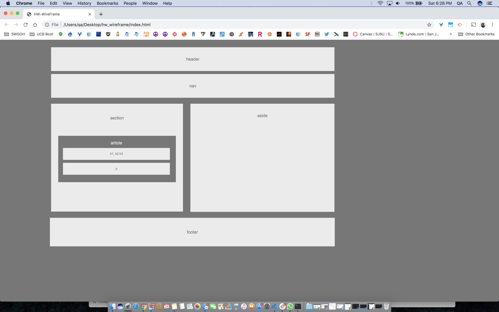

# Title: HW-Wireframe (re-do)

## Site Picture:


## Technologies Used:
- HTML: Used to create elements 
- CSS: Used to describe th elements within the html
- Git: Used to document the changes of the source code
- GitHub: Used to create the repository for the html and css in which that can be pushed to GitHub domain

## Summary:
I built html file and css file where I created elemental boxes ranging from a 'p' box within a section to creating a seperate aside box all within the the wireframe container. I also used divisional classes in defining the variables of the stacked boxes

## Code Snippet:
```html
     <div class="division"> <!--Created a 2nd divisional html element in order to control the attribute settings specfically for the h2 and p box sections located within the 'section' boxed section-->
        
        
        <section> <!--Created the 'Section' box -->
             <br> <!--First use of the br code in this file in order to create that indentation for the header in this boxed section-->
            section
        <article> <!--Created the 'article' section -->
            <br>
            article
            <br>
                 <h2>h1, h2 h3</h2> <!--Creation of the 'h1, h2, h3' section in used the <h2></h2> header command-->
                 <p>p</p> <!--Made the p boxed section right here where p and h2 are within the 'section' box-->
        </article>
    </section>
    </div>
  
```


## Author Links:
[GitHub](https://github.com/duongsters)